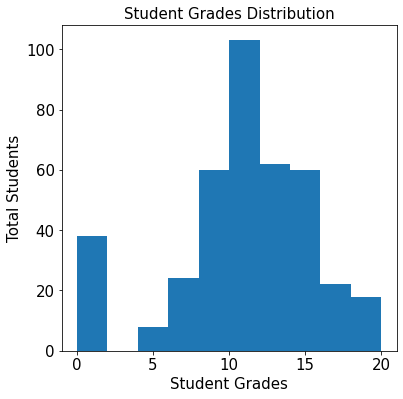
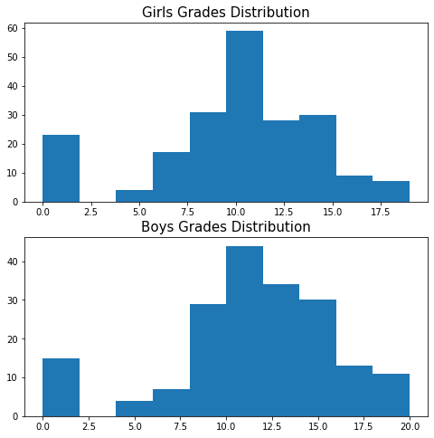
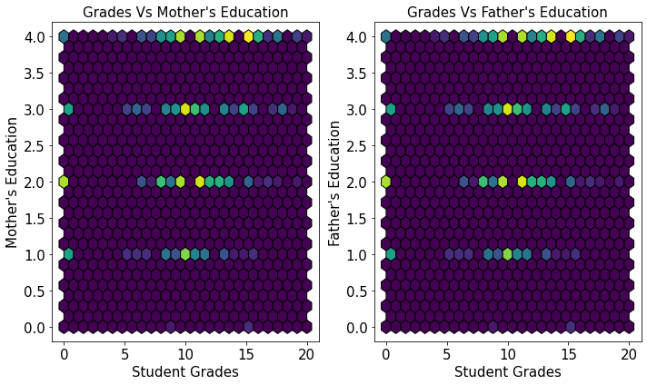
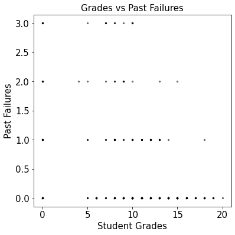
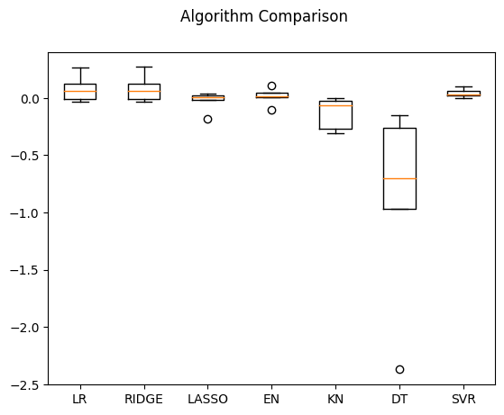
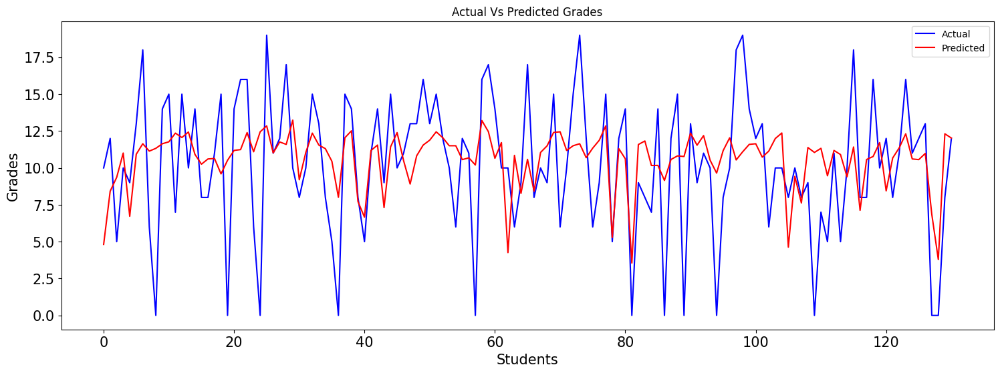
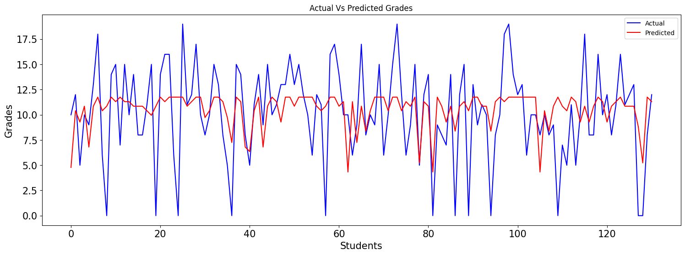
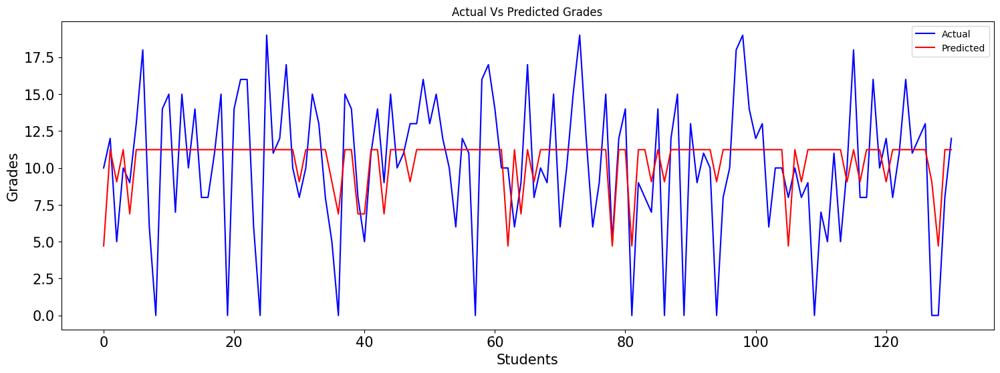

### DSCI521 Course Project

# Data Analysis and Interpretation

_This project is intended to provide some open-ended experience with exploring datasets for possible associations, relationships, and predictive capacities. This will then be followed up with the execution more complex and intensive analysis that prototypes the function of a potential application or underpin an empirical finding. Specifically, all projects for this course will entail the following two phases:_

1. _A topically-motivated exploration of available pre-processed datasets and providing EDA  (exploratory data analyses)._
2. _Interpreting the outcome of phase (1), the selection and execution of a more in depth analytics project, prototyping an application's function or empirical investigation._
---

### Our Team:
- Harsh Bolakani hvb36@drexel.edu
- Greg Morgan gm655@drexel.edu
- Trevor Pawlewicz tmp365@drexel.edu
---

## Our Topic: _School Grade Analysis_
>
> ### We will explore the area of the activities of a students of a secondary school and what attributes contribute or detract from getting good grades.
>
> _Attributes in our datasets are taken from a Math course and Portuguese language course in the country of Portugal._
>
> #### We will be asking the questions in our data analysis exporation:
> - Are there any what contributing factors to a good grade?
> - Are there any what contributing factors to a low grade?
> - Does alcholhol play a part in either?
> - Are any other factors found to determine a higher/lower grade?
>
> #### Analytic tools and data-medium we will be working with:
> - CSV
>
> #### During our Exploratory Data Analysis journey we will also try to address the following points:
> - who might be interested in our analysis and why
>
> #### We will also give insight into the following journey during our analysis:
> - Context of Data found/used
> - Data preprocessing if needed
> - Our Exploratory Data Analysis
> - Our Results
> - Conclusion on our analysis
---
## Our Phase 1 Report:
>
> #### 1. Background report on the team's members, their self-identified skills, and individual contributions (Areas of expertise):
> - **Harsh:** Java, Backend-Development, API-Development, Test Automation, API, Library Design
> - **Greg:** Strengths: Python, AWS Cloud Based Architectures, REST API development, Data Streaming Technologies
> - **Trev:** Front-end UI, Evidence-based User Experience, Design Thinking, Team Leadership
>
>
> #### 2. Provide a discussion of what you would like to your analysis to do, who and what it will support by answering the following questions:
>   - try to predict students final grade.
>   - Are there any what contributing factors to a good grade?
>   - Are there any what contributing factors to a low grade?
>   - Does alcholhol play a part in either?
>   - Are any other factors found to determine a higher/lower grade?
>
>
> #### 3. Provide an exhibition of analyses from dataset(s) explored, including visual analyses, captions, and useful descripitions
> ##### _Attrributes analized:_
>   - school - student's school (binary: 'GP' - Gabriel Pereira or 'MS' - Mousinho da Silveira)
>   - sex - student's sex (binary: 'F' - female or 'M' - male)
>   - age - student's age (numeric: from 15 to 22)
>   - address - student's home address type (binary: 'U' - urban or 'R' - rural)
>   - famsize - family size (binary: 'LE3' - less or equal to 3 or 'GT3' - greater than 3)
>   - Pstatus - parent's cohabitation status (binary: 'T' - living together or 'A' - apart)
>   - Medu - mother's education (numeric: 0 - none, 1 - primary education (4th grade), 2 – 5th to 9th grade, 3 – secondary education or 4 – higher education)
>   - Fedu - father's education (numeric: 0 - none, 1 - primary education (4th grade), 2 – 5th to 9th grade, 3 – secondary education or 4 – higher education)
>   - Mjob - mother's job (nominal: 'teacher', 'health' care related, civil 'services' (e.g. administrative or police), 'at_home' or 'other')
>   - Fjob - father's job (nominal: 'teacher', 'health' care related, civil 'services' (e.g. administrative or police), 'at_home' or 'other')
>   - reason - reason to choose this school (nominal: close to 'home', school 'reputation', 'course' preference or 'other')
>   - guardian - student's guardian (nominal: 'mother', 'father' or 'other')
>   - traveltime - home to school travel time (numeric: 1 - <15 min., 2 - 15 to 30 min., 3 - 30 min. to 1 hour, or 4 - >1 hour)
>   - studytime - weekly study time (numeric: 1 - <2 hours, 2 - 2 to 5 hours, 3 - 5 to 10 hours, or 4 - >10 hours)
>   - failures - number of past class failures (numeric: n if 1<=n<3, else 4)
>   - schoolsup - extra educational support (binary: yes or no)
>   - famsup - family educational support (binary: yes or no)
>   - paid - extra paid classes within the course subject (Math or Portuguese) (binary: yes or no)
>   - activities - extra-curricular activities (binary: yes or no)
>   - nursery - attended nursery school (binary: yes or no)
>   - higher - wants to take higher education (binary: yes or no)
>   - internet - Internet access at home (binary: yes or no)
>   - romantic - with a romantic relationship (binary: yes or no)
>   - famrel - quality of family relationships (numeric: from 1 - very bad to 5 - excellent)
>   - freetime - free time after school (numeric: from 1 - very low to 5 - very high)
>   - goout - going out with friends (numeric: from 1 - very low to 5 - very high)
>   - Dalc - workday alcohol consumption (numeric: from 1 - very low to 5 - very high)
>   - Walc - weekend alcohol consumption (numeric: from 1 - very low to 5 - very high)
>   - health - current health status (numeric: from 1 - very bad to 5 - very good)
>   - absences - number of school absences (numeric: from 0 to 93)
>
>
> #### 4. Provide a discussion of who might be interested in your analysis:
>   - Parents
>   - School officials with legitimate educational interest;
>   - Other schools to which a student is transferring;
>   - Specified officials for audit or evaluation purposes;
>   - Appropriate parties in connection with financial aid to a student;
>   - Organizations conducting certain studies for or on behalf of the school;
>   - Accrediting organizations;
>   - To comply with a judicial order or lawfully issued subpoena;
>   - Appropriate officials in cases of health and safety emergencies; and
>   - State and local authorities, within a juvenile justice system, pursuant to specific State law.
>
>
> #### 5. Provide a discussion of how your analysis might fit into an application or investigation:
>   - How does Portuguel align with United States government statistics: by age 15, nearly 30% of kids have had at least one drink, and by age 18, that figure leaps to almost 60%?
>   - Formulate possible Reasons why teens drink include.
>
>
> #### 6. Provide a discussion of how your analysis is limited and could be improved
>   - Dataset is limited to the Country of Portuguel of seconday students: drinking age (18) is much lower than United States.
>       - The legal drinking age in Portugal is 18 years. Initially, the legal age was 17 years, but it has been raised to 18 since the rise of illegal sales and bad alcoholism influence among young kids. However, in most cases, there is an exception for minors aged 16 and 17 to consume a glass of beer, wine, or cider with a meal in a restaurant if they are with their family.
>
>
> #### 7. Provide a selection of data for continued analysis, including justification
>   - we could expand apon the test subjects and include higher grade levels
>   - we could expand apon the class subjects that are analized
>   - conduct a survey for data anaysis in the United States
>
>
> #### 8. Provide a discussion of how your analysis might be completed and disseminated, i.e., who's the target audience?
>   - this could be public record for Public Service Announcements.
>   - Could also be used to help parents understand the effects of underage drrinking and how it is applied to academic progress.
---

## Part A: Exploratory Data Analysis

> In this section, we will be doing EDA on the data set chosen for our project (https://www.kaggle.com/datasets/uciml/student-alcohol-consumption).
>
> 
>
> This data set includes student data (personal, family etc) and the corresponding grade that they received in Math and Portuguese. Our Goal in this section is to determine factors that contribute to a good grade and find correlation of various factors with student grades.


__A1.__ Load the csv data into a pandas data frame.

```python
import pandas as pd

def load_data(path_to_salaries_csv):

    df = pd.read_csv(path_to_salaries_csv, sep = ",", header =0)

    return df

# Load the data using our function
student_data = load_data('./data/student-mat.csv')

# Output the first 10 rows
print(student_data.head())
```
_A1 output:_

|school | sex | age | address | famsize | Pstatus | Medu | Fedu | Mjob | Fjob |
|:-----:|:---:|:---:|:-------:|:-------:|:-------:|:----:|:----:|:----:|:----:|  
|0   |  GP  | F  | 18   |    U  |   GT3   |    A  |   4   |  4 | at_home  | teacher | ... |  
|1   |  GP  | F  | 17   |    U  |   GT3   |    T  |   1   |  1 | at_home  |   other | ... |  
|2   |  GP  | F  | 15   |    U  |   LE3   |    T  |   1   |  1 | at_home  |   other | ... |  
|3   |  GP  | F  | 15   |    U  |   GT3   |    T  |   4   |  2 |  health  |services | ... |  
|4   |  GP  | F  | 16   |    U  |   GT3   |    T  |   3   |  3 |   other  |   other | ... |  

|famrel | freetime | goout | Dalc | Walc | health | absences | G1 | G2 | G3 |
|:-----:|:--------:|:-----:|:----:|:----:|:------:|:--------:|:--:|:--:|:--:|   
|0    |  4     |   3    |  4  |   1   |  1  |    3   |     6 |  5  | 6 |  6  |
|1    |  5     |   3    |  3  |   1   |  1  |    3   |     4 |  5  | 5 |  6  |
|2    |  4     |   3    |  2  |   2   |  3  |    3   |    10 |  7 |  8 | 10  |
|3    |  3     |   2    |  2  |   1   |  1  |    5   |     2 | 15 | 14 | 15  |
|4    |  4     |   3    |  2  |   1   |  2  |    5   |     4 |  6 | 10 | 10|

##### __A1 (Data Summary)__. Let us look at some high level information abut the data. Data information, Total rows, Total number of Girls and Boys etc.

```python
print(student_data.info())
print(student_data["sex"].value_counts())
print("Total Counts: ", student_data["G3"].count())
```
_output:_
```
RangeIndex: 395 entries, 0 to 394
Data columns (total 33 columns):
 #   Column      Non-Null Count  Dtype
---  ------      --------------  -----
 0   school      395 non-null    object
 1   sex         395 non-null    object
 2   age         395 non-null    int64
 3   address     395 non-null    object
 4   famsize     395 non-null    object
 5   Pstatus     395 non-null    object
 6   Medu        395 non-null    int64
 7   Fedu        395 non-null    int64
 8   Mjob        395 non-null    object
 9   Fjob        395 non-null    object
 10  reason      395 non-null    object
 11  guardian    395 non-null    object
 12  traveltime  395 non-null    int64
 13  studytime   395 non-null    int64
 14  failures    395 non-null    int64
 15  schoolsup   395 non-null    object
 16  famsup      395 non-null    object
 17  paid        395 non-null    object
 18  activities  395 non-null    object
 19  nursery     395 non-null    object
...
F    208
M    187
Name: sex, dtype: int64
Total Counts:  395
count          395.000000
mean            10.415190
std              4.581443
min              0.000000
25%              8.000000
50%             11.000000
75%             14.000000
max             20.000000

Name: G3, dtype: float64
```

---

__A2__. We will now try to visualize the Total grades of students using a histogram so we can find the variation and centrality of grades. We can also get basaic statistics about the final grades.

```Python
from matplotlib import pyplot as plt

hist_fig = plt.figure(figsize = (6,6))

_ = plt.hist(student_data["G3"])

plt.tick_params(labelsize = 15)

_ = plt.title("Student Grades Distribution", fontsize = 15)
_ = plt.xlabel("Student Grades", fontsize = 15)
_ = plt.ylabel("Total Students", fontsize = 15)

print("Grades Meta-data", student_data["G3"].describe())
```
_A2 output:_
```
Grades Meta-data count    395.000000
mean                       10.415190
std                         4.581443
min                         0.000000
25%                         8.000000
50%                        11.000000
75%                        14.000000
max                        20.000000

Name: G3, dtype: float64
```



---

__A3__. Next we can try to analyze if this same trend is observed with Girls and Boys seperately. For this we will filter the student_data data set based on sex column and plot this curve separately

```python
girls_data = student_data[student_data["sex"] == "F"]
boys_data = student_data[student_data["sex"] == "M"]

fig = plt.figure(figsize = (8,8))

# girls plot
ax = fig.add_subplot(2,1,1)
_ = plt.hist(girls_data["G3"])
_ = plt.title("Girls Grades Distribution", fontsize = 15)

# boys plot
ax = fig.add_subplot(2,1,2)
_ = plt.hist(boys_data["G3"])
_ = plt.title("Boys Grades Distribution", fontsize = 15)
```



##### __A3 (Summary).__ From the above comparison, it seems that there are not big differences in the variations of grades in the case of boys and girls. So we will turn our attention to other parameters.

---

__A4__. We will now try to find relationship between Father and Mother's education to the final grade, G3 score. According to the documentation of the data we have the columns `Medu` and `Fedu` that correspond to Mother's and Father's education levels:

> `Medu` - mother's education (numeric: 0 - none, 1 - primary education (4th grade), 2 – 5th to 9th grade, 3 – secondary education or 4 – higher education)

> `Fedu` - father's education (numeric: 0 - none, 1 - primary education (4th grade), 2 – 5th to 9th grade, 3 – secondary education or 4 – higher education)

We can use a scatter plot to visualize the relationship between mother's education and final grades of the students

```python
fig = plt.figure(figsize=(10,6))

ax = fig.add_subplot(1,2,1)
#_ = plt.scatter(student_data["G3"],student_data["Medu"], color = "black", s = 5, alpha = 0.5)
_ = plt.hexbin(student_data["G3"],student_data["Medu"], color = "black", gridsize = 25)

plt.tick_params(labelsize = 15)

_ = plt.title("Grades Vs Mother's Education", fontsize = 15)

_ = plt.xlabel("Student Grades", fontsize = 15)
_ = plt.ylabel("Mother's Education", fontsize = 15)

ax = fig.add_subplot(1,2,2)
_ = plt.hexbin(student_data["G3"],student_data["Medu"], color = "black", gridsize = 25)

plt.tick_params(labelsize = 15)

_ = plt.title("Grades Vs Father's Education", fontsize = 15)

_ = plt.xlabel("Student Grades", fontsize = 15)
_ = plt.ylabel("Father's Education", fontsize = 15)

plt.tight_layout()
```



__A4.1__ It does seem like there is a positive correlation between the Mother's and Father's education with the students final grade. We can use a correlation paramter to confirm this hypothesis. In this section we will calculaate the spearman correlation between the Father's and Mother's education to verify this.

```python
import scipy.stats

print("Correlation of Grades with Mother's education", round(scipy.stats.spearmanr(student_data["Medu"], student_data["G3"])[0],2))
print("Correlation of Grades with Father's education", round(scipy.stats.spearmanr(student_data["Fedu"], student_data["G3"])[0],2))
```
##### __A4 (Summary):__. It seems there is a better correlation with Mother's educetion with student's grades and as seen in the visualization, the students that have the highest grades have their mother completed Higher education.

---

__A5__. Now let us compute the spearman correlation of all other numeric data with grades and find out if we have a feature that is highly correlated with the student's Grades

```python
list_features = [ column for column in list(student_data.columns) if student_data[column].dtype == "int64" ]
print(list_features)
```

_A5 output:_
```
['age', 'Medu', 'Fedu', 'traveltime', 'studytime', 'failures', 'famrel', 'freetime', 'goout', 'Dalc', 'Walc', 'health', 'absences', 'G1', 'G2', 'G3']
```

We will get the final correlation_list sorted on absolute value of correlation:

```python
# A5:Compute spearman correlation for all the fields:

correlation_list = [(feature,round(scipy.stats.spearmanr(student_data[feature], student_data["G3"])[0],2)) for feature in list_features]
sorted_correlation_list =  sorted(correlation_list, reverse=True, key= lambda x: abs(x[1]))
print(sorted_correlation_list)
```

_A5 output:_
```
[('G3', 1.0), ('G2', 0.96), ('G1', 0.88), ('failures', -0.36), ('Medu', 0.23), ('age', -0.17), ('Fedu', 0.17), ('goout', -0.17), ('traveltime', -0.12), ('Dalc', -0.12), ('studytime', 0.11), ('Walc', -0.1), ('famrel', 0.05), ('health', -0.05), ('absences', 0.02), ('freetime', -0.0)]
```

##### __A5 (Summary)__. According to the output above, it seems like past failures have a negative correlation with grades. (We can ignore G1 and G2 scores as those are just factor into the calculation of the final grades.

---

__A6__. Now we will visualize the relationship between the final grades and past failures.

```python
fig = plt.figure(figsize=(6,6))

_ = plt.scatter(student_data["G3"], student_data["failures"], color="black", s=5, alpha=0.5)               
plt.tick_params(labelsize = 15)
_ = plt.title("Grades vs Past Failures", fontsize=15)
_ = plt.xlabel("Student Grades", fontsize = 15)
_ = plt.ylabel("Past Failures", fontsize=15)
```



##### __A6 (Summary)__. From the visualization above, we can see that the students with higher grades are mostly the one's that haven't failed in the past.

---

__A7.1.__ we will now explore the correlation with some of the non integer and categorical feilds such as whether the student is in a romantic relationship or if the student is interested in higher education and so on. For this we will have to do some preprocessing to turn them into integer values. We will use a a value of 0 for No and 1 for Yes.

```python
def correlation_category(column,description):
    student_data[column+"_label"] = student_data.apply(lambda x: 1 if x[column]=="yes" else 0, axis=1)
    print("Correlation of Grades with "+description, round(scipy.stats.spearmanr(student_data[column+"_label"], student_data["G3"])[0],2))

correlation_category("romantic","Romantic")
correlation_category("higher","Interest in Higher Education")
correlation_category("internet","Internet Availability")
correlation_category("activities","Extra Curricular activities")
correlation_category("paid","Paid Course")
correlation_category("famsup","Family Support")
correlation_category("schoolsup","School Support")
```
_A7.1 output:_
```
Correlation of Grades with Romantic -0.09
Correlation of Grades with Interest in Higher Education 0.17
Correlation of Grades with Internet Availability 0.11
Correlation of Grades with Extra Curricular activities 0.03
Correlation of Grades with Paid Course 0.06
Correlation of Grades with Family Support -0.05
Correlation of Grades with School Support -0.15
```

__A7.2__. For some of the fields, the data is not available in yes and no, but they are still binary and so we can pre process the data accordingly and view the correlation data.

```python
student_data["pstatus_label"] = student_data.apply(lambda x: 1 if x["Pstatus"]=="T" else 0, axis=1)
print("Correlation of Grades with Parent CohAbitation Status", round(scipy.stats.spearmanr(student_data["pstatus_label"], student_data["G3"])[0],2))

student_data["famsize_label"] = student_data.apply(lambda x: 1 if x["famsize"]=="LE3" else 0, axis=1)
print("Correlation of Grades with Family Size", round(scipy.stats.spearmanr(student_data["famsize_label"], student_data["G3"])[0],2))

student_data["address_label"] = student_data.apply(lambda x: 1 if x["address"]=="U" else 0, axis=1)
print("Correlation of Grades with Address Type", round(scipy.stats.spearmanr(student_data["address_label"], student_data["G3"])[0],2))
```
_A7.2 output:_
```
Correlation of Grades with Parent CohAbitation Status -0.04
Correlation of Grades with Family Size 0.07
Correlation of Grades with Address Type 0.12
```

##### __A7 (Summary)__. Considering all the categorical feilds, it seems that "Interset in Higher Education" has the best correlation with Student Grades

#### __PART A (Summary)__. Based on the result of EDA of trying to find out what correlates to a student's grade, we can list the following top 4 features that have an absolute correlation value of 0.17 or more
1. Past Failures (Negative Correlation)
2. Mother's Education (Positive)
3. Father's Education (Positive)
4. Interest in Higher Education (Positive)
5. Age (Negative)
6. Going Out (Negative)

#### _Based upon these findings, we will proceed in PART B to train a model and Predict Student's grades..._

---
## Part B: Student Grade Prediction

In this section, we will attempt to train a prediction model to predict student grades in Math given information about students. We will use the information of our EDA from Part A and only focus on the features of interest mentioned above.

__B1__. Let us start by using all the above features that contribute to a student's grade and Build  ML Model using it. We will use Linear Regression from `sklearn`.

```python
# Linear Regression

x = student_data[["failures","Medu","Fedu","higher_label","age","goout"]].values
y = student_data["G3"]

print(x.shape)
```

_B1 output:_
```
(395, 6)
```

next, _Algorithm Comparison:_

```Python
from sklearn import linear_model
from sklearn.neighbors import KNeighborsRegressor
from sklearn.tree import DecisionTreeRegressor
from sklearn.tree import DecisionTreeRegressor
from sklearn.svm import SVR
from sklearn.metrics import accuracy_score
from sklearn import model_selection
import numpy as np

models = {}
models['LR'] = LinearRegression()
models['RIDGE'] = Ridge()
models['LASSO'] = Lasso()
models['EN'] = ElasticNet()
models['KN'] = KNeighborsRegressor()
models['DT'] = DecisionTreeRegressor()
models['SVR'] = SVR()

results = []
for name, model in models.items():
    cv_results = model_selection.cross_val_score(model, x, y,  cv=5, scoring="r2")
    results.append(cv_results)
    print(f"{name}: {cv_results.mean()} ({cv_results.std()})")

# Compare Algorithms
fig = plt.figure()
fig.suptitle('Algorithm Comparison')
ax = fig.add_subplot(111)
plt.boxplot(results)
ax.set_xticklabels(models.keys())
plt.show()
```

_output:_
```
LR: 0.08141497103453654 (0.10776804673856544)
RIDGE: 0.08264293789836405 (0.10728300462241515)
LASSO: -0.027593780309592274 (0.07784086844338022)
EN: 0.01190158645605619 (0.06847974688226648)
KN: -0.13343831204969386 (0.12784174434875145)
DT: -0.8918701190832186 (0.7971977887165463)
SVR: 0.042555155125241884 (0.03607808739474081)
```




next, _Linear Regression:_

```python
from sklearn.linear_model import LinearRegression
from sklearn.model_selection import train_test_split
import numpy as np

lm = LinearRegression()

# create training and test sets
x_train, x_test, y_train, y_test = train_test_split(x, y, test_size=0.33, random_state=42)

# Train the model using the training sets
lm.fit(x_train, y_train)

# predict on a separate testing set
predictions = lm.predict(x_test)

# compute the SSE
SSE = sum((np.array(y_test) - predictions)**2)

# compute the RMSE
RMSE = np.sqrt(SSE/len(predictions))

print(RMSE)
```

_output:_
```
4.302867250886894
```

```python
print(lm.score(x_test,y_test))
```

_output:_
```
0.16007498821516808
```

---

__B2__. The accuracy is not promising (Only 16%).

We can plot the predicted and actual values to see where our model is making most errors.

```python
from matplotlib import pyplot as plt
linefig = plt.figure(figsize=(18,6))

x_axis = list(range(len(predictions)))

_  = plt.plot(x_axis, y_test, color="blue", label='Actual')
_  = plt.plot(x_axis, predictions, color="red", label="Predicted")

plt.tick_params(labelsize=15)

_ = plt.xlabel("Students",fontsize=15)
_ = plt.ylabel("Grades", fontsize=15)
plt.legend()
_ = plt.title("Actual Vs Predicted Grades")
```




##### __B2 (Summary)__. We can see that the trend is similar but the predictions are not as close to actual. It seems that the model is able to predict the low graders better than high graders.

---

__B3__. Let us try with fewer features and only focus on the top 2 (Past Failures and Mother's Education)


```python
# Linear Regression

x = student_data[["failures","Medu"]].values
y = student_data["G3"]

print(x.shape)
```

_output:_
```
(395, 2)
```

```python
lm = LinearRegression()

# create training and test sets
x_train, x_test, y_train, y_test = train_test_split(x, y, test_size=0.33, random_state=42)

# Train the model using the training sets
lm.fit(x_train, y_train)

# predict on a separate testing set
predictions = lm.predict(x_test)

# compute the SSE
SSE = sum((np.array(y_test) - predictions)**2)

# compute the RMSE
RMSE = np.sqrt(SSE/len(predictions))

print(RMSE)
```

_output:_
```
4.286294431408094
```

```python
print(lm.score(x_test,y_test))
```

_output:_
```
0.16653259797234732
```

```python
linefig = plt.figure(figsize=(18,6))

x_axis = list(range(len(predictions)))

_  = plt.plot(x_axis, y_test, color="blue", label='Actual')
_  = plt.plot(x_axis, predictions, color="red", label="Predicted")

plt.tick_params(labelsize=15)

_ = plt.xlabel("Students",fontsize=15)
_ = plt.ylabel("Grades", fontsize=15)
plt.legend()
_ = plt.title("Actual Vs Predicted Grades")
```




##### __B3 (Summary)__ Not much Improvement. We can see that the trend is similar but the predictions are not as close to actual. It seems that the model is able to predict the low graders better than high graders, The Accuracy increase a bit to 16.6%

---

##### Summarizing:

```python
# Linear Regression

x = student_data[["failures"]].values
y = student_data["G3"]

print(x.shape)
```

_output:_
```
(395, 1)
```

```python
lm = LinearRegression()

# create training and test sets
x_train, x_test, y_train, y_test = train_test_split(x, y, test_size=0.33, random_state=42)

# Train the model using the training sets
lm.fit(x_train, y_train)

# predict on a separate testing set
predictions = lm.predict(x_test)

# compute the SSE
SSE = sum((np.array(y_test) - predictions)**2)

# compute the RMSE
RMSE = np.sqrt(SSE/len(predictions))

print(RMSE)
```

_output:_
```
4.3609938531325545
```

```python
print(lm.score(x_test,y_test))
```

_output:_
```
0.13722894272732822
```

```Python
linefig = plt.figure(figsize=(18,6))

x_axis = list(range(len(predictions)))

_  = plt.plot(x_axis, y_test, color="blue", label='Actual')
_  = plt.plot(x_axis, predictions, color="red", label="Predicted")

plt.tick_params(labelsize=15)

_ = plt.xlabel("Students",fontsize=15)
_ = plt.ylabel("Grades", fontsize=15)
plt.legend()
_ = plt.title("Actual Vs Predicted Grades")
```



#### __PART B (Summary)__. It seems our prediction model is able to predict the lower grades better than higher graders and this itself is useful information for Parents and Teachers so that they can take corrective actions based on the set of input parameters.

---


